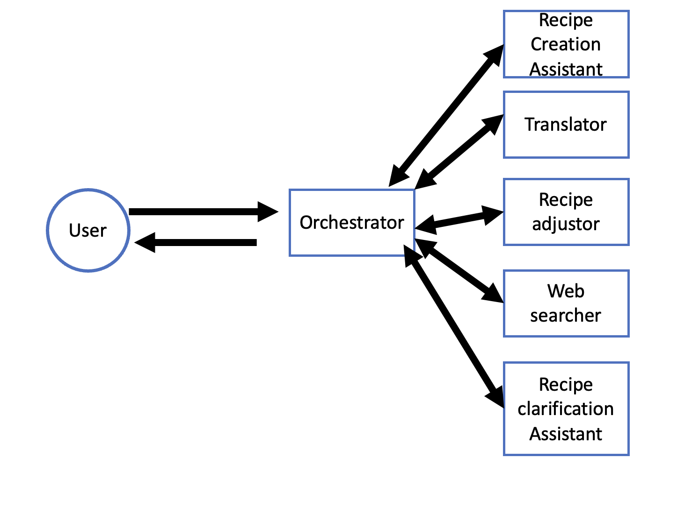
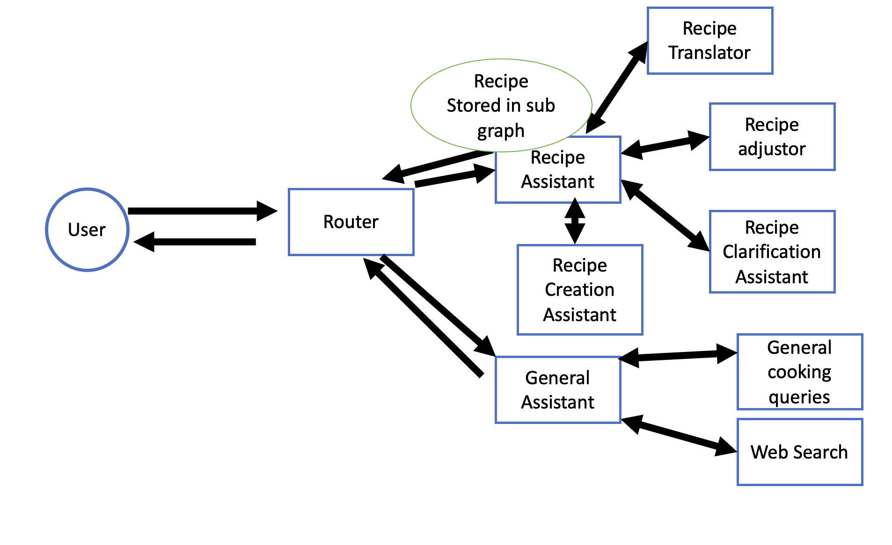

# How to run the code

First, create a `.env` file with the `OPENAI_API_KEY`:
```
OPENAI_API_KEY=your_api_key
```
This should go in the root folder of the project. It will be used by the cookbot.

## Run the cookbot and gptbot using Docker Compose (RECOMMENDED)

To run both the `cookbot` and `gptbot` services using Docker Compose, execute the following commands from the root folder:

### Cookbot (Cooking Assistant)
```bash
docker compose build cookbot
docker compose up cookbot -d
```

**Access the web interface at:** `http://localhost:9090`

**Access MLflow UI at:** `http://localhost:5000`

To stop the cookbot:
```bash
docker compose down
```

### Gptbot (Production Bot)
```bash
docker compose build gptbot
docker compose up gptbot -d
```

**Access the API at:** `http://localhost:8000`

To stop the gptbot:
```bash
docker compose down
```

### Run Both Services Together
```bash
docker compose build
docker compose up -d
```

This will start both services with their dependencies (MLflow for cookbot).

**Note:** MLflow runs on port 5000 and tracks all cookbot interactions, experiments, and tool usage. If you encounter MLflow UI dropdown issues, ensure you're using MLflow version 2.8.1 (as configured in the Dockerfile).


## Run with Minikube locally

I set them up on kubernetes, however this was not particulartly useful as our interactions happen in the command line at the moment and there is no frontend.

### Running on Minikube

1. **Start Minikube**

   ```bash
   minikube start
   ```

   Check status:

   ```bash
   minikube status
   ```

   Make sure the output shows the apiserver is running and kubeconfig is configured.

2. **Point Docker to Minikube**

   This makes your docker build commands use Minikube's internal Docker daemon:

   ```bash
   eval $(minikube docker-env)
   ```

3. **Build Docker Images**

   Build the cookbot and gptbot images locally (no external registry needed):

   ```bash
   docker build -t cookbot:local -f dockerfiles/Dockerfile.cookbot .
   docker build -t gptbot:local -f dockerfiles/Dockerfile.gptbot .
   ```

4. **Create a ConfigMap from .env (for cookbot)**

   If your .env file has secrets (passwords, tokens, etc.), consider creating a Secret instead.

   ```bash
   kubectl create configmap cookbot-env --from-env-file=.env
   ```

5. **Deploy to Minikube**

   Apply your Kubernetes manifests (Deployments/Service). Make sure your YAML references `cookbot:local` and `gptbot:local`.

   ```bash
   kubectl apply -f k8s-all.yaml
   ```

6. **Verify Pods**

   ```bash
   kubectl get pods
   kubectl get deployments
   ```

   They should show `cookbot`, `gptbot-api`, `gptbot`, and `mlflow` as Running.

7. **Access MLflow UI on Minikube**
   
   ```bash
   minikube service mlflow --url
   ```
   
   This will give you the external URL to access the MLflow UI.

8. **Access Application Output**

   - **View Logs**: To see the output of your application, use:

    ```bash
    kubectl logs <pod-name>
    ```

   - **Access into the bots**: 
    ```bash
    kubectl exec -it <pod-name> -- /bin/bash
    ```
    if you access into the cookbot and gptbot you can call:
    ```bash
    python src/main.py
    ```
    For the cookbot.
    ```bash
    python interactive_chat.py for the bot
    ``` 
    For the gptbot.

     

## Run the cookbot directly - Cooking assistant

If you prefer to run the `cookbot` services using docker.

```bash
docker build -t cookbot -f dockerfiles/Dockerfile.cookbot .
docker run -it --env-file .env --name cookbot cookbot python src/main.py
```

To stop and remove the container:
```bash
docker stop cookbot
docker rm cookbot
```


Alternatively, you can install the requirements with Python 3.11 and run:
```bash
pip install -r requirements-cookbot.txt
cd cookbot
export PYTHONPATH=.
python src/main.py
```

## Run the gptbot  directly- Production Bot

To run the `gptbot` service individually , use the following commands:

```bash
docker build -t gptbot -f dockerfiles/Dockerfile.gptbot .
docker run -d -p 8000:8000 --name gptbot gptbot uvicorn app.main:app --host 0.0.0.0 --port 8000
docker ps # check the container is running and the command is uvicorn
# you should wait a few seconds, maybe 30 seconds. THIS WILL WORK JUST WAIT FOR UVICORN TO START
docker exec -it gptbot python interactive_chat.py
```

To stop and remove the container:
```bash
docker stop gptbot
docker rm gptbot
```

Alternatively, you can install the requirements with Python 3.11 and run:
```bash
pip install -r requirements-gptbot.txt
cd gptbot
export PYTHONPATH=.
uvicorn app.main:app --host 0.0.0.0 --port 8000 --reload
# in a separate terminal
cd gptbot
export PYTHONPATH=.
python interactive_chat.py
```

## Where are the solutions?

Solutions are in the `README.md` file.


# Cooking Assistant

## Approach

### Main Design Decisions

I am using LangGraph as it allows more customization to the graph, allows parallelization and it supports more complex workflows. I am creating a ReACT workflow as I would need to really define the user behaviour and the requirements to justify a more complex workflow. In my ReAct workflow I am using tools to call the agents and a main orchestrator agent regulates the use of the tools. I implemented a custom graph for scalability and modifications we might need. I am splitting the problem into components so that we can iterate on them and improve them with the appropriate prompts.

Another option I considered was to use a router node instead of using tools. This could limit the flexibility (and latency also) of the bot but guarantee more modularity and a better flow for the user. 

I thought about modifying the graph state with "current recipe" so that the graph has always stored the current recipe being considered and all the nodes of the graph can access that. I think this will depend on the user behaviour and in the current design it does not make sense. We do not do that but we make agent tools that are called 

## Improvements and Detailed Suggestions

1. **Multi-LLM Support and Fallback Mechanism**  
   - **Why?** To ensure system reliability if the primary LLM fails or degrades in performance.
   - **How?** Implement a base `LLM` class that wraps multiple backend LLMs, exposing a unified interface, performing health checks, and routing requests as needed.

2. **Optimized Prompt Engineering and Input/Output Types**  
   - **Why?** Specialized agents like translation or clarification often fail with generic prompts.
   - **How?** Systematically iterate on prompt structures, test with sample data, and refine until agents consistently produce desired results. Handle agent failures in the orchestrator agent. See src/prompts.py for more details.

3. **Router Agent for Modularization**  
   - **Why?** Decouples agent logic, making it easier to extend or replace sub-agents.
   - **How?** Use a central router to parse intent and redirect requests to domain-specific sub-agents like `RecipeAssistant` or `GeneralAssistant`.

4. **Handling Language Switching**  
   - **Why?** Switching languages in a conversation can break context or lead to inaccuracies. We first want to define how we want to handle language switching by analyzing the user behaviour.
   - **How?** We need to handle language as part of the graph state most likely.

5. **JSON Schema Translation**  
   - **Why?** Over-translating user data leads to confusion.
   - **How?** Modify the translation pipeline to only target JSON keys, leaving other sections in their original form.

6. **Comprehensive Testing and Error Handling**  
   - **Why?** Ensures stability and robust performance under various edge cases.
   - **How?** Write unit tests for each tool, add integration tests for agent workflows, and handle exceptions using Pydantic validation or custom error logic.

7. **Improving the Web Search Tool**  
   - **Why?** Current implementation is complex and difficult to extend.
   - **How?** Break down the web search logic into smaller components—fetching, parsing, and summarizing—so each step is easier to test and maintain.

8. **Chat History Management**  
   - **Why?** Proper management of conversation context improves performance.
   - **How?** Store each user turn and assistant response in a structured manner, possibly with metadata (language, timestamp, etc.), to recall and adapt to past interactions accurately.

9. **Clarification Output**  
   - **Why?** Current output is not structured.
   - **How?** Use a structured output for clarification responses.

10. **Code Modularization**  
    - **Why?** A large monolithic file or set of functions becomes unmanageable quickly.
    - **How?** Organize the codebase into folders (e.g., `agents/`, `tools/`, `models/`), and establish clear boundaries between them.
11. **RAG and RLHF**
    - **Why?** To improve the performance of the bot
    - **How?** Implement RAG and RLHF for instance in the recipe reccomendation agent


## High Level Architecture - My system and an improved version (Not implemented)

The below is a high level architecture showing the current implementation with ReAct workflow and tools.



The below is a possible improved version with router agents (NOT IMPLEMENTED HERE). I put web search under general assistant, although it might also go under recipe assistant or an entirely new agent.



## Agents Description

See src/prompts.py for the prompts. The input/output types are in src/pydantic_types.py. The errors are in src/error_messages.py. The tools are in src/tool_functions.py.

#### Orchestrator
- **Role/Name**: Orchestrator
- **Goals**: answers the user query using the tools available
- **Example Prompts**:
  - whatever the user inputs
- **Input**: text
- **Output**: text
- **Relevant design decisions**: react agent with tools available. The system prompt is crafted to give good initial instructions to the bot. 

#### Create Recipe from Intent
- **Role/Name**: create_recipe_from_intent
- **Goals**: Create a recipe from a natural language intent
- **Example Prompt**: "I want to make a chocolate cake with a rich chocolate flavor and a moist texture."
- **Input**: natural language intent
- **Output**: Recipe
- **Relevant design decisions**: We use a structured output to create the recipe.

#### Translate Recipe
- **Role/Name**: translate_recipe
- **Goals**: Translate the recipe to the target language
- **Example Prompt**: "Translate this chocolate chip cookie recipe to Spanish"
- **Input**: Recipe (ingredients, quantities, units, steps), language
- **Output**: Translated steps and ingredients
- **Relevant design decisions**: We only translate ingredients and steps, not quantities and units

#### Adjust Recipe Quantities
- **Role/Name**: adjust_recipe_quantities
- **Goals**: Scale recipe quantities based on natural language input
- **Example Prompts**: 
  - "Double this chocolate chip cookie recipe"
  - "Make this recipe for 6 people instead of 4"
  - "Cut this recipe in half"
- **Input**: Recipe (ingredients, quantities, units, steps), natural language adjustment request
- **Output**: Adjusted quantities for all ingredients
- **Relevant design decisions**: Uses an intermediate ScalingFactor type to determine the multiplier, then applies it to all quantities

#### Web Search
- **Role/Name**: web_search
- **Goals**: Find similar recipes online using DuckDuckGo search
- **Example Prompts**:
  - "Find similar recipes for this chocolate chip cookie recipe"
  - "Show me alternative versions of this pasta carbonara"
- **Input**: Recipe (ingredients, quantities, units, steps)
- **Output**: List of similar recipes with their sources
- **Relevant design decisions**: Creates search query using first 3 ingredients and initial step, then structures raw search results into SearchResults type

#### Clarify Recipe Step
- **Role/Name**: clarify_recipe_step
- **Goals**: Provide detailed explanations for unclear recipe steps
- **Example Prompts**:
  - "What does 'cream together butter and sugar' mean?"
  - "How do I know when the pasta is 'al dente'?"
  - "What temperature should 'medium-high heat' be?"
- **Input**: Recipe (ingredients, quantities, units, steps), user's clarification request
- **Output**: Detailed explanation addressing the user's specific question
- **Relevant design decisions**: Returns natural language explanation without structured output, focused on addressing specific user questions about recipe steps

### Commentary on Prompt Engineering

Building logic into the agents and constraining the LLM output and inputs is a good practice in a multi-agent framework. As far as improving the prompt we should follow the OpenAI guidelines and best practices (I was not careful with this) or use more advanced methods. Other methods are:

- **One-Shot / Few-Shot Prompting**: Include one or a few examples to guide the model's output toward a particular format or style. This is most effective if we need to guide the model's output toward a particular format or style or we need some logic.

- **Chain-of-Thought Prompting (CoT)**: Ask the model to show its reasoning steps explicitly, improving clarity and potentially accuracy. With specialized tasks, we can break down the task into smaller tasks and then we can use CoT.

- **Self-Consistency**: Generate multiple reasoning paths (chains-of-thought) and select the most consistent final answer.

- **ReAct (Reason + Act)**: We already use it here but we could use more. Combine step-by-step reasoning with explicit "action" instructions, useful for iterative or tool-using tasks

- **Iterative Refinement** I never tried it but it seems to be a good method.


# Production Bot

## How it works

The bot follows a simple request-response flow below. the configuration is in app/config/config.py.
The chat service is in app/services/chat_service.py. I am using FastAPI as it is a simple way to create an API. I am running the bot using float16 precision, again we would need to have the functional and non functional requirements to define expected behaviour and latency.

1. **API Request**
   - User sends request to FastAPI endpoint
   - Request contains message and optional session ID
   - First-time users will have session ID set to None

2. **Session Management**
   - System creates new session ID if none exists
   - Session manager stores conversation state in memory
   - Periodic cleanup prevents unbounded memory growth

3. **Conversation Processing**
   - System retrieves conversation history using session ID
   - Bot generates response based on:
     - Current user input
     - Previous conversation context
   - Conversation history is updated with new exchange

4. **API Response**
   - System returns:
     - Bot's response
     - Session ID for future requests
   - Session ID enables conversation continuity

## Areas for Improvement

### Bot Answers

- Improve Answers - we have implemented memory of the conversations but we have not tested the answers, actually a lot of answers don't make much sense (The way we feed the roles, the prompt,  the temperature parameter should be tuned)
- Answer length handling - Now the bot reserves some tokens for answers but not ideal.

### Code Structure
- Enhanced modularization and error handling - I did not have time to write non functional tests and most functional tests.
- More robust architectural design
- Comprehensive test coverage beyond core functionality

### Infrastructure
- Containerization using Docker Compose
- Production-grade session management with appropriate database/cache(e.g., Redis)
- Database integration for persistent storage


